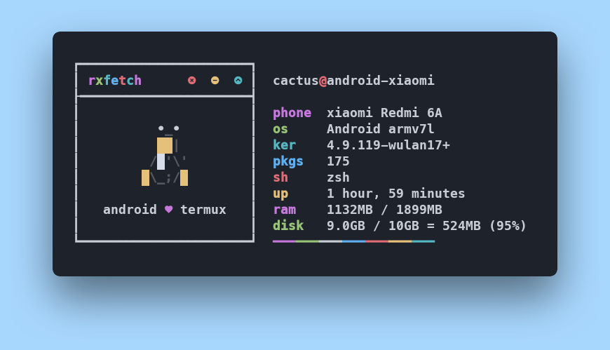

<h1 align="center">rxfetch-termux</h1>

rxfetch-termux is a Termux Fetch Fork of [rxfetch](https://github.com/Mangeshrex/rxfetch)

## Showcase
**Upload your custom script `rxfetch-termux` [here](https://github.com/mayTermux/rxfetch-termux/issues/1)**
